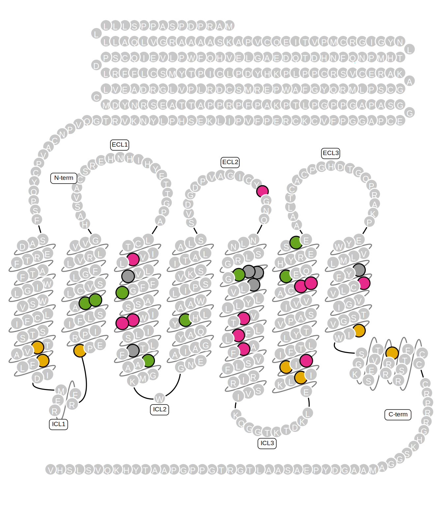

----------

# Description

This R notebook attempts the analysis of an array of mutants in one of the 10 human [Frizzled](https://en.wikipedia.org/wiki/Frizzled) receptors, Frizzled 5 (FZD5). Each mutant was predicted to alter receptor function based on computational structure/function analysis. The mutants are expected to either promote or repress receptor activation through Wnt binding. The canonical signaling cascade is: Wnt --> FZDR --> DVL --> GSK-3b --> APC --> beta-catenin --> gene regulation.

Different types of experimental data ares available:

- `data/input/FZD_mutations.csv` - original GPCR computer model prediction of mutant effects
- `data/input/DVL_shift.csv` - Dishevelled (DVL) shift assay. Measures the phosphorylation status of the intracellular signal protein DVL through the FZD5 receptor (and its mutants)
- `data/input/DEP_recruitment.csv` - DEP recruitment assay. DEP is a truncated DVL and recruitment is measured via BRET, that indicates proximity of the two proteins with fluorescence transfer
- `data/input/TOPFlash.csv` - Top flash assay. Measures if a target gene of the beta-catenin signaling pathway becomes activated, relative to WT
- `data/input/Gq4Ains.csv` - 

# Prerequisites

Load required packages.

```{r, message = FALSE }
suppressPackageStartupMessages({
  library(tidyverse)
  library(ggrepel)
  library(lattice)
  library(latticeExtra)
  library(latticetools)
  library(scales)
  library(dendextend)
  library(factoextra)
  library(vegan)
})
```

Define global figure style, default colors, and other optional parameters.

```{r}
# custom ggplot2 theme that is reused for all later plots
custom_colors = c("#E7298A", "#66A61E", "#E6AB02", "#7570B3", "#B3B3B3", "#1B9E77", "#D95F02", "#A6761D")
custom_range <- function(n = 5) {colorRampPalette(custom_colors[c(1,5,2)])(n)}
```


# Data import

Load raw data tables.

```{r}
# load main table with processed sequencing data
df_dep_recr <- read_csv("../data/input/DEP_recruitment.csv", col_types = cols()) %>%
  mutate(mutation = factor(mutation, unique(mutation)))

df_dvl_shift <- read_csv("../data/input/DVL_shift.csv", col_types = cols()) %>%
  mutate(mutation = factor(mutation, unique(mutation)))

df_top_flash <- read_csv("../data/input/TOPFlash.csv", col_types = cols()) %>%
  mutate(mutation = factor(mutation, unique(mutation)))

df_gq4a <- read_csv("../data/input/Gq4Ains.csv", col_types = cols()) %>%
  mutate(mutation = factor(mutation, unique(mutation)))

df_bret0 <- read_csv("../data/input/BRET0_assay.csv", col_types = cols()) %>%
  mutate(mutation = factor(mutation, unique(mutation)))
```

# Exploratory analysis

## DEP recruitment

BRET values for all mutants.

```{r, fig.width = 6, fig.height = 8}
xyplot(value ~ mutation | type, df_dep_recr,
  par.settings = custom.colorblind(),
  between = list(x = 0.5, y = 0.5),
  layout = c(1,2),
  scales = list(alternating = FALSE, x = list(rot = 90), y = list(relation = "free")),
  panel = function(x, y, ...) {
    panel.grid(h = -1, v = -1, col = grey(0.9))
    panel.errbars(as.numeric(x)+0.5, y, col = grey(0.75), ewidth = 0, ...)
    panel.xyplot(x, y, ...)
  }
)
```

BRET50 and BRETmax value correlation for all mutants. There is no real correlation.

```{r, fig.width = 8, fig.height = 4}
plot_bret_cor1 <- df_dep_recr %>%
  pivot_wider(names_from = "type", values_from = "value") %>%
  xyplot(BRET50 ~ BRETmax, .,
    par.settings = custom.colorblind(),
    between = list(x = 0.5, y = 0.5),
    title = "linear BRET 50",
    scales = list(alternating = FALSE, x = list(rot = 90)),
    panel = function(x, y, ...) {
      panel.grid(h = -1, v = -1, col = grey(0.9))
      panel.xyplot(x, y, ...)
      panel.lmlineq(x, y, r.squared = TRUE, fontfamily = "FreeSans", ...)
    }
  )

plot_bret_cor2 <- df_dep_recr %>%
  pivot_wider(names_from = "type", values_from = "value") %>%
  xyplot(log10(BRET50) ~ BRETmax, .,
    par.settings = custom.colorblind(),
    between = list(x = 0.5, y = 0.5),
    title = "log10 BRET 50",
    scales = list(alternating = FALSE, x = list(rot = 90)),
    panel = function(x, y, ...) {
      panel.grid(h = -1, v = -1, col = grey(0.9))
      panel.xyplot(x, y, ...)
      panel.lmlineq(x, y, r.squared = TRUE, fontfamily = "FreeSans", ...)
    }
  )

print(plot_bret_cor1, split = c(1,1,2,1), more = TRUE)
print(plot_bret_cor2, split = c(2,1,2,1))
```

The correlation and the distribution of the data improves when BRET50 data is log-transformed. Although more a cosmetic approach, we log10-transform the BRET50 data to make more use of it for now.

```{r}
df_dep_recr <- df_dep_recr %>%
  mutate(value = case_when(type == "BRET50" ~ log10(value), TRUE ~ value))
```


## DVL shift assay

```{r, fig.width = 6, fig.height = 4}
df_dvl_shift %>%
  xyplot(value ~ mutation, .,
    par.settings = custom.colorblind(),
    between = list(x = 0.5, y = 0.5),
    scales = list(alternating = FALSE, x = list(rot = 90)),
    panel = function(x, y, ...) {
      panel.grid(h = -1, v = -1, col = grey(0.9))
      panel.errbars(as.numeric(x)+0.5, y, col = grey(0.75), ewidth = 0, ...)
      panel.xyplot(x, y, ...)
    }
  )
```
## Top flash assay

```{r, fig.width = 6, fig.height = 4}
df_top_flash %>%
  xyplot(value ~ mutation, .,
    par.settings = custom.colorblind(),
    between = list(x = 0.5, y = 0.5),
    scales = list(alternating = FALSE, x = list(rot = 90)),
    panel = function(x, y, ...) {
      panel.grid(h = -1, v = -1, col = grey(0.9))
      panel.errbars(as.numeric(x)+0.5, y, col = grey(0.75), ewidth = 0, ...)
      panel.xyplot(x, y, ...)
    }
  )
```

## GQ 4-alanin insertion

```{r, fig.width = 6, fig.height = 4}
df_gq4a %>%
  xyplot(value ~ mutation, .,
    par.settings = custom.colorblind(),
    between = list(x = 0.5, y = 0.5),
    scales = list(alternating = FALSE, x = list(rot = 90)),
    panel = function(x, y, ...) {
      panel.grid(h = -1, v = -1, col = grey(0.9))
      panel.errbars(as.numeric(x)+0.5, y, col = grey(0.75), ewidth = 0, ...)
      panel.xyplot(x, y, ...)
    }
  )
```

## BRET-zero assay (conformation sensor)

```{r, fig.width = 6, fig.height = 4}
df_bret0 %>%
  xyplot(value ~ mutation, .,
    par.settings = custom.colorblind(),
    between = list(x = 0.5, y = 0.5),
    scales = list(alternating = FALSE, x = list(rot = 90)),
    panel = function(x, y, ...) {
      panel.grid(h = -1, v = -1, col = grey(0.9))
      panel.errbars(as.numeric(x)+0.5, y, col = grey(0.75), ewidth = 0, ...)
      panel.xyplot(x, y, ...)
    }
  )
```

## Combine assays and check correlation

There are different numbers of replicates. We need to summarize all tables to mean +/- standard deviation and then combine them.

```{r}
df_combined <- bind_rows(
  df_dep_recr,
  df_dvl_shift,
  df_top_flash,
  df_gq4a,
  df_bret0)

df_summary <- df_combined %>%
  group_by(type, n_mutation, mutation) %>%
  summarize(.groups = "drop",
    mean_value = mean(value, na.rm = TRUE),
    sd_value = sd(value, na.rm = TRUE)
  )

head(df_summary)
```

Check pairwise correlation of variables.

- DVL shift and top flash is correlated
- DVL shift and BRET max is correlated
- BRET 50 is anti-correlated DVL shift and top flash

```{r, fig.width = 6, fig.height = 6}
df_summary %>% select(-sd_value) %>%
  pivot_wider(values_from = mean_value, names_from = type) %>%
  select(matches("BRET|DVL|GQ4|TOP")) %>%
  custom_splom(pch = 19, cex = 1, col = grey(0.4, 0.4))
```

Which mutations are most like each similar in their behavior?
We need to cluster mutations by similarity of experimental results.
In order to make different variables comparable, we rescale every var to a range between zero and one.

```{r}
mat_summary <- df_summary %>% select(-sd_value) %>%
  pivot_wider(values_from = mean_value, names_from = type) %>%
  select(matches("^mutation|BRET|DVL|GQ4|TOP")) %>%
  column_to_rownames(var = "mutation") %>%
  as.matrix %>% apply(2, rescale)

# create cluster for reordering
mat_cluster <- mat_summary %>% dist %>% hclust(method = "ward.D2")
mat_heatmap <- mat_summary[order.dendrogram(as.dendrogram(mat_cluster)), c(1,2,3,5,4,6)]
```

How many clusters are optimal?
Use silhouette analysis to determine optimal number of clusters.

```{r, fig.width = 4, fig.height = 4}
silhouette_result <- Rtools::silhouette_analysis(mat = mat_heatmap, n_repeats = 20)
n_clusters <- silhouette_result$optimal_n_clust
paste("Optimal number of clusters is: ", n_clusters)
```


```{r,fig.width = 4, fig.height = 4}
xyplot(avg_width ~ n_cluster,
  silhouette_result$data_summary,
  par.settings = custom.colorblind(),
  panel = function(x, y, ...) {
    panel.grid(h = -1, v = -1, col = grey(0.9))
    panel.xyplot(x, y, ...)
    panel.smoother(x, y, ...)
    panel.abline(v = n_clusters, lty = 2)
  }
)
```

Heatmap and similarity dendrogram.

```{r, fig.width = 7, fig.height = 4.75}
plot_heatmap <- levelplot(mat_heatmap,
  par.settings = custom.colorblind(),
  col.regions = custom_range(10),
  at = seq(0, 1, 0.1), aspect = "fill",
  xlab = "", ylab = "",
  scales = list(x = list(rot = 90)),
  panel = function(x, y, z, ...) {
    panel.levelplot(x, y, z, ...)
    panel.abline(h = 1:ncol(mat_heatmap)+0.5, col = "white", lwd = 1.5)
  }
)

plot_cluster_dend <- mat_cluster %>% as.dendrogram %>%
  set("branches_k_col", custom_colors[1:n_clusters], k = n_clusters) %>%
  set("branches_lwd", 0.5) %>%
  as.ggdend %>%
  ggplot(labels = FALSE)

gridExtra::grid.arrange(
  # coords for unit: top, right, bottom, left
  plot_cluster_dend + 
    theme(plot.margin = unit(c(0.25, 0.118, -0.28, 0.172),"npc")),
  plot_heatmap,
  nrow = 2
)
```

```{r, fig.width = 8, fig.height = 4}
# set a seed to obtain same pattern for stochastic methods
set.seed(123)

# run nMDS analysis
NMDS <- mat_heatmap %>% dist %>% metaMDS(trace = 0)
df_nmds <- NMDS$points %>% as_tibble(rownames = "mutation") %>%
  left_join(enframe(cutreeord(mat_cluster, k = n_clusters), "mutation", "cluster")) %>%
  mutate(MDS2 = MDS2*-1)

plot_nmds <- xyplot(MDS2 ~ MDS1, df_nmds,
    groups = cluster, par.settings = custom.colorblind(),
    aspect = 1, main = "nMDS", label = df_nmds$mutation,
    panel = function(x, y, label, ...) {
      panel.grid(h = -1, v = -1, col = grey(0.9))
      panel.xyplot(x, y, ...)
      panel.key(..., cex = 0.7, corner = c(0.98, 0.98))
      panel.repellabels(x, y, labels = label, cex = 0.5, draw_box = TRUE,
        box_fill = grey(0.9, alpha = 0.7), ...)
    }
  )

# run PCA analysis
pca_result <- prcomp(mat_heatmap)
df_PCA <- pca_result$x %>%
  as_tibble(rownames = "mutation") %>%
  left_join(enframe(cutreeord(mat_cluster, k = n_clusters), "mutation", "cluster"))

plot_pca <- xyplot(PC2 ~ PC1, df_PCA,
    groups = cluster, z = 0.3+rescale(df_PCA$PC3),
    par.settings = custom.colorblind(), label = df_PCA$mutation,
    aspect = 1, main = "PCA",
    panel = function(x, y, z, label, ...) {
      panel.grid(h = -1, v = -1, col = grey(0.9))
      tactile::panel.bubbleplot(x, y, z, ...)
      panel.key(..., cex = 0.7, corner = c(0.98, 0.98))
      panel.repellabels(x, y, labels = label, cex = 0.5, draw_box = TRUE,
        box_fill = grey(0.9, alpha = 0.7), ...)
    }
  )

print(plot_nmds, split = c(1,1,2,1), more = TRUE)
print(plot_pca, split = c(2,1,2,1))
```

Some details on the PCA result:

- eigenvalues measure the amount of variation retained by each principal component
- variable contribution measures the amount of variation explained by each variable

See excellent description at:
http://www.sthda.com/english/articles/31-principal-component-methods-in-r-practical-guide/112-pca-principal-component-analysis-essentials/

```{r, fig.width = 8,fig.height = 4}
plot_pca_eig <- get_eigenvalue(pca_result) %>%
  mutate(dimension = seq_along(eigenvalue)) %>%
  xyplot(variance.percent ~ factor(dimension), .,
    par.settings = custom.colorblind(),
    main = "PCA eigenvalues",
    panel = function(x, y, ...) {
      panel.grid(h = -1, v = -1, col = grey(0.9))
      panel.barplot(x, y, ...)
    }
  )

# multiply eigenvalues (variation) with variable contribution
plot_pca_var <- data.frame(as.matrix(get_pca_var(pca_result)$contrib) *
  rep(get_eigenvalue(pca_result)$variance.percent/100, each = length(pca_result$sdev))) %>%
  rownames_to_column("variable") %>%
  pivot_longer(cols = -variable, names_to = "dimension", values_to = "variance") %>%
  mutate(dimension = str_remove(dimension, "Dim.")) %>%
  xyplot(variance ~ factor(dimension), .,
    groups = variable,
    par.settings = custom.colorblind(),
    main = "PCA variable contribution",
    panel = function(x, y, ...) {
      panel.grid(h = -1, v = -1, col = grey(0.9))
      panel.barplot(x, y, beside = TRUE, ...)
      panel.key(..., pch = 15, corner = c(0.98, 0.98))
    }
  )

print(plot_pca_eig, split = c(1,1,2,1), more = TRUE)
print(plot_pca_var, split = c(2,1,2,1))
```

# Structure function relationship

To plot activity data on an SVG map of a receptor, we need the custom R package `fluctuator` that can import and manipulate SVG graphic files.

```{r, eval = FALSE}
devtools::install_github("m-jahn/fluctuator")
```

Import the SVG of the 'snakeplot', the representation of a receptor as AA residues curled in their different membrane spanning domains.

```{r}
library(fluctuator)

svg_fzd5 <- read_svg("../data/input/FZD5_human_snakeplot.svg")
head(svg_fzd5@summary)
```

Manipulate certain amino acids by changing color.
We can identify nodes by their `id` field, and make changes to fill and stroke color.

```{r}
get_attributes(svg_fzd5, node_attr = "id", node = "333",
  attr = c("id", "class", "fill", "stroke"))
```

```{r}
df_cluster <- df_PCA %>% filter(mutation != "WT") %>%
  select(mutation, cluster) %>%
  mutate(position = str_sub(mutation, 2, 4)) %>%
  mutate(color = custom_colors[cluster])

svg_fzd5_color <- set_attributes(svg_fzd5, node_attr = "id",
  node = df_cluster$position, attr = "fill",
  pattern = ".*",
  replacement = df_cluster$color)
```

Export modified SVG.

```{r}
write_svg(svg_fzd5_color, "../data/output/FZD5_human_snakeplot_color.svg")
```

The resulting graphic:

Original snake plot  |  Color-coded snake plot
:-------------------------:|:-------------------------:
  |  


# Session Info

```{r}
sessionInfo()
```

